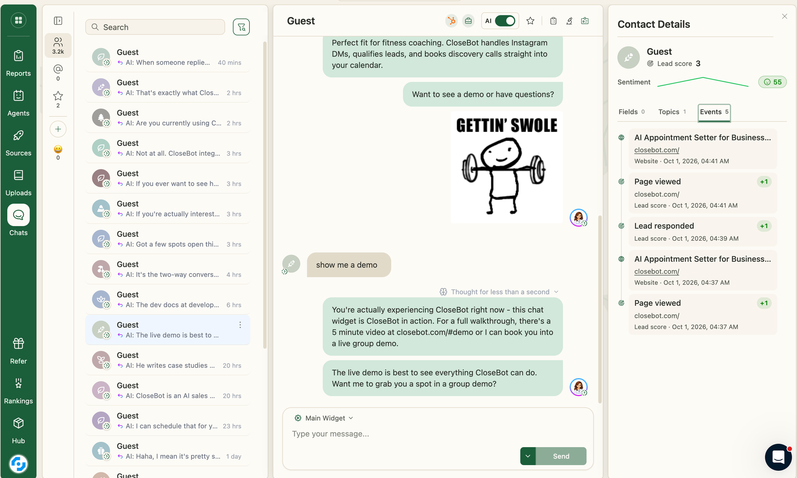

Hype posts are all over Facebook right now and it's exhausting.  "I switched to Codex", "I switched back to Claude", "I now have Claude manage my Codex which manages my Ask AI in HighLevel to build AI websites" (please don't do that).

Point is, there's a lot of noise out there.  And they are all trying to sell you something.  Here are the 3 AI tools I use every single day that matter in our business at CloseBot.

## #1 [CloseBot](https://closebot.com/) for ai appointment setting ($97)

Wow, shocker, CloseBot founder recommending CloseBot... ya.  It's the freaking best at sales.  Don't take my word for it, check out [our reviews](https://closebot.com/reviews/).

Why do people use this instead of built in options like HighLevel's Conversational AI?  Well, it earns them more revenue.  Even non-feature things like occassionally breaking up messages like a human would, ability to creatively use GIFs (when appropriate), and much higher uptime... this all means more money and less headache.  Not to mention all of the [features](https://closebot.com/compare/highlevel-vs-closebot/) packed into the product that HighLevel users are begging for, but will never have.

## #2 Claude Code ($200)

At CloseBot we are Anthropic fans.  What originally drew me to Anthropic over OpenAI was their research.  As a company built on research ourselves, we know how much it matters when we see a company built on a foundation of data.

"So what do you do when OpenAI comes out with a better or cheaper model?".  Simple... I keep using Claude.  First of all, lots of those benchmarks are bogus.  They look good on paper, but are shit in production.  Rather than spend 3 hours split testing both I spend that time on our own product or with my family.  I suggest you do the same.

We use Claude Code to accelerate dev work on our software application as well as assist in blog outline creation, SEO research and much more general automation.

## #3 ChatGPT ($20)

Bet you didn't expect to see that after my #2 listed above... But Claude and Claude Code don't do image stuff.  I need something to throw together thumbnails for videos, in-line blog images, etc.

Simple.  It's my artist.

## Summary

Don't get caught up in all the hype.  Use what works.  Don't let people online make you feel like you're behind just because you don't have 12 AI tools to juggle.  More than likely, those who feel the need to juggle 12 AI tools are doing so in an attempt to find their big break... and you don't need to be taking the opinions of people who aren't doing what you want to be doing yourself... earning actual revenue.
